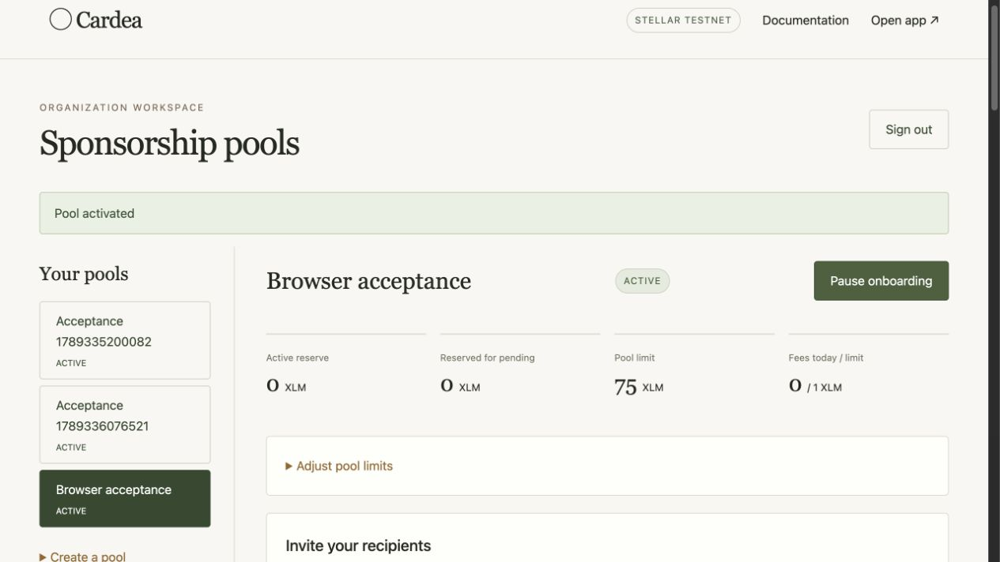
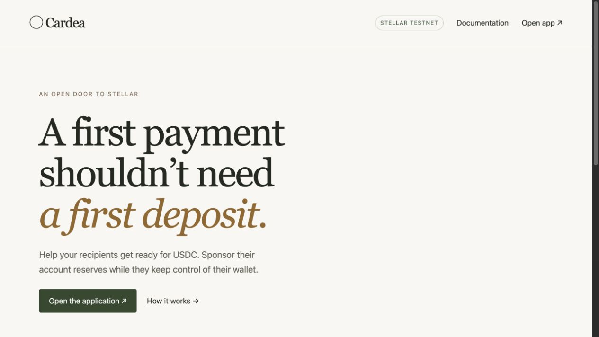

# Cardea delivery evidence

## Current public evidence (2026-09-30)

| Scope | Direct evidence | Limit |
| --- | --- | --- |
| D1 — sponsor-funded account and USDC trustline | [Successful mainnet transaction](https://horizon.stellar.org/transactions/ca46d4efba204821eb1fc5261feabdfe110ef10ddf85055bd9b2679d2a9463b0), [recipient account](https://horizon.stellar.org/accounts/GBAZEXYOSXGGSR6OY67SOWFRVSJHYIZESA7T672OJ2UHIIBIJSLUYYFV): 0 XLM, USDC trustline, recipient sole signer, sponsor on both entries. [Automated testnet acceptance](testnet-1790637958630.json) includes modified-request and non-allowlisted rejection checks. | The mainnet account holds 0 USDC; this demonstrates readiness to receive it, not a payout. |
| D2 — pool and operator workflow | [Live recipient directory](https://cardea.website/receive), [live sectioned documentation](https://cardea.website/docs/#organizations), [continuous testnet walkthrough](https://cardea.website/evidence/instawards-testnet-walkthrough.mp4), [isolated-demo result](instawards-testnet-20260930.json), and [confirmed listed-recipient transaction](https://horizon-testnet.stellar.org/transactions/1d2bb1cd398ffe048d18a25c5f649f93fa33e386cf355014118d568748dcb881). The demo created a 50-place private pool, uploaded 50 addresses, received HTTP 404 for a non-allowlisted address, and opened a zero-XLM USDC-ready account for one listed address. | The walkthrough records actual operator browser actions. Its rejection and transaction summary is an explicitly labeled display of API/Horizon results. The recipient transaction was signed by a throwaway test key through the API, not the Freighter extension. The isolated testnet pool is separate from live mainnet. |
| D3 — reserve recovery and handover | [Automatic graduation on testnet](https://horizon-testnet.stellar.org/transactions/3a3977bc95edcadaf53b755e23908d89d83586b0e16d1594579ad35b03641d14) and [sponsor handover on testnet](https://horizon-testnet.stellar.org/transactions/d05137d9aaf27433f67d1fd4cda8b8768a08bd0662cceb3d3052e6a79a2b4285), with archived before/after state in [graduation](automatic-graduation-1789336323865.json) and [acceptance](testnet-1790637958630.json) records. | These two maintenance flows have testnet evidence; they have not been exercised with real mainnet XLM. |

The delivery code and test suite are published in [Fatih's public repository](https://github.com/glckfatih2018-prog/cardea). The older release notes below describe the state when each record was created; statements marked pending there are historical and do not override the dated evidence above.

## September 30 mainnet pilot status

A separate mainnet pilot site and API, worker, and signer processes are deployed. The four mainnet role accounts were funded in [one atomic transaction](https://horizon.stellar.org/transactions/d6f0c60c81bf8d7ddef690a9dcc0d6d89d985ad6275101ba1a1eace8d9ba74a2), and their signing thresholds were set to 1; read-only preflight passes 42/42 service and 30/30 signer checks. A locally signed [mainnet onboarding](mainnet-pilot-20260930.json) through the production HTTPS API created a zero-XLM recipient with a sponsored USDC trustline; the Cardea intent is `CONFIRMED`. A subsequent [mainnet Freighter acceptance](mainnet-freighter-public-20260930.json) created another zero-XLM recipient and sponsored USDC trustline. The public pilot pool is listed at [the recipient directory](https://cardea.website/receive), with one public admission per UTC day, a 15 XLM installation reserve ceiling, and a dedicated sponsor account. The independent source security scan of commit `9ef6856` identified two low-severity issues: UTC-boundary fee accounting and synchronous password verification under distributed attempts. Both have regression tests and fixes in the subsequent patch. The mainnet signer also refuses a missing or changed journal. The patched candidate passed 129 isolated tests, TypeScript/production build, and an audit with zero known production dependency advisories. An [isolated restore drill](mainnet-empty-restore-20260930.json) restored the then-empty pilot database and signer journal. A second isolated restore after onboarding verified the nonempty signer journal and confirmed intent from an encrypted off-host backup. These results do not replace recurring encrypted off-host backups or an external audit. See [the mainnet runbook](../MAINNET.md).

## September 29 mainnet-capable candidate (not deployed to mainnet)

The isolated candidate passed 116 PostgreSQL-backed tests, TypeScript checking,
the production web build, and a production-dependency audit with zero known
advisories. Its [new real Stellar testnet acceptance](testnet-1790637958630.json)
records 12 checks and 12 transactions, including ten zero-XLM USDC onboarding
transactions, handover and graduation. The candidate also includes regression
tests for rewrapped fee bumps, unresolved submissions during monitoring,
unsigned public-request limits, archival, bounded graduation, browser XDR
validation and mainnet preflight. These are local and testnet results.

The separate [real testnet inner-hash check](testnet-inner-hash-1790638343101.json)
submitted a fee bump from a second payer and confirmed that Horizon resolves
the landed transaction by its inner hash while reporting the foreign fee account
and outer hash. This directly exercises the lookup relied on by reconciliation.

An independent review of the candidate patch and real Freighter acceptance
remain open. No mainnet account was funded, no mainnet transaction was signed,
and no production readiness claim follows from this section. The deployment
and operator decisions are in [the mainnet runbook](../MAINNET.md).

Recorded September 14, 2026 (Europe/Istanbul). The files describe observed results; the planning matrix is not a checklist of automatically passed tests.

## Executed verification

| Check | Result / artifact |
| --- | --- |
| Clean clone of implementation commit | [db97ec1 verification](clean-clone.json): npm ci, build, 58 tests and audit passed |
| TypeScript and production web build | Passed, `npm run build` |
| PostgreSQL-backed application/security suite | **58/58 passed**, [test output](test-output.log), `npm test`; fake ledger permits deterministic failure injection |
| Focused security subset | 16/16 passed; included in the 58, not additional tests |
| Dependency advisories | 0 known vulnerabilities in full dependency audit at release check |
| Real testnet acceptance | Two runs, each 10 concurrent zero-XLM onboardings; latest [testnet-1789336076521.json](testnet-1789336076521.json) |
| Automatic background graduation | Two separate-worker runs; latest [automatic-graduation-1789336323865.json](automatic-graduation-1789336323865.json) |
| Browser operator workflow | Pool created, 50-address CSV uploaded, activated, paused, reactivated; limits changed and restored |
| Landing page and docs | Root introduction, application link, documentation and operator routes verified locally |
| Security findings | Five repaired findings and regression details in [SECURITY.md](../../SECURITY.md) |

The live acceptance harness confirms the fixed USDC issuer/trustline, zero native balance, sole recipient signer, sponsor balance unchanged while reserve units increase, fee-payer debit equal to actual ledger fees, unique leased channels, replay idempotence, non-allowlisted rejection, zero-balance graduation refusal, sponsor handover and graduation.

**Historical September 14 limit:** Automated fixture signing did not establish Freighter acceptance. The then-connected testnet wallet was already funded and could not demonstrate zero-XLM account creation. The later Mainnet Freighter acceptance is linked in the current evidence table above.

## Transaction evidence

Latest automatic graduation (the harness only funds a fixture; a separate continuously running worker notices eligibility and releases reserve):

[3a3977bc95edcadaf53b755e23908d89d83586b0e16d1594579ad35b03641d14](https://stellar.expert/explorer/testnet/tx/3a3977bc95edcadaf53b755e23908d89d83586b0e16d1594579ad35b03641d14)

Latest handover (both institutional sponsors sign, recipient does not):

[fb90682bba16b9bbfd8a6194675a204a3b6e7656bab7719628f410f2f962df5e](https://stellar.expert/explorer/testnet/tx/fb90682bba16b9bbfd8a6194675a204a3b6e7656bab7719628f410f2f962df5e)

Every onboarding hash and returned transaction/account snapshot is in the acceptance JSON. Testnet resets may remove explorer history. JSON evidence contains public data and signed, expired testnet envelopes, never private keys or invitation/session credentials.

## Operator demonstration

[Continuous Instawards testnet walkthrough](instawards-testnet-walkthrough.mp4) and its [public result record](instawards-testnet-20260930.json) were recorded on an isolated local testnet installation. The recording shows pool creation, a 50-address allowlist, activation, the confirmed recipient in the organization workspace, and the Horizon transaction. A final labeled screen reports the actual API rejection for an unlisted address. The recipient signed with a throwaway test key through the Cardea API; this recording does **not** claim a Freighter browser-signing session. Invitation links visible in the recording were rotated afterward, so they no longer work.

[24-second operator walkthrough](operator-walkthrough.mp4) is a sequence of eight authentic browser captures held for three seconds each, **not continuous real-time video**. It shows pool creation, CSV import and activation/pause controls. The invitation displayed during the captures was rotated afterward. The pending-intent safety check correctly delayed activation while the automatic graduation test was in flight; activation succeeded after reconciliation.

## Requirement status at 30 September 2026

- **D1:** Real Mainnet Freighter onboarding and real testnet acceptance are linked above. The recipient controls the sole signer; the sponsor funds reserves and fees.
- **D2:** The [continuous isolated testnet demo](instawards-testnet-walkthrough.mp4) shows the operator flow. Its [result record](instawards-testnet-20260930.json) and Horizon transaction establish one accepted and one rejected recipient. The accepted demo recipient signed through the API with a test key, not Freighter.
- **D3:** Automatic graduation and sponsor handover are proven by testnet transactions. Neither maintenance operation has been exercised with real Mainnet XLM.
- **Publication:** The product and documentation are public at [cardea.website](https://cardea.website/); the release source is in [Fatih's public repository](https://github.com/glckfatih2018-prog/cardea).
- **Operations:** The Mainnet pilot passed an isolated encrypted restore drill. That does not substitute for recurring off-host backups or an independent audit.

The technical evidence and source are ready for review. Formal SOW acceptance is the reviewer's decision.

## Reproduce

Follow [Operations](../OPERATIONS.md) with dedicated test keys and database. Run `npm ci`, `npm run build`, `npm test`, and `npm run security`. Stop the background worker for `npm run test:testnet`; the harness manages reconciliation itself. Then restart the worker and run `npm run test:auto`; that harness never invokes the application's maintenance or tick methods.

Never reuse a recipient key fixture as a real wallet. Setup and recipient keys stay under ignored `.local/`. Public wallet roles are recorded in the private local ledger when `CARDEA_WALLET_LEDGER` is supplied; no private values are published.
